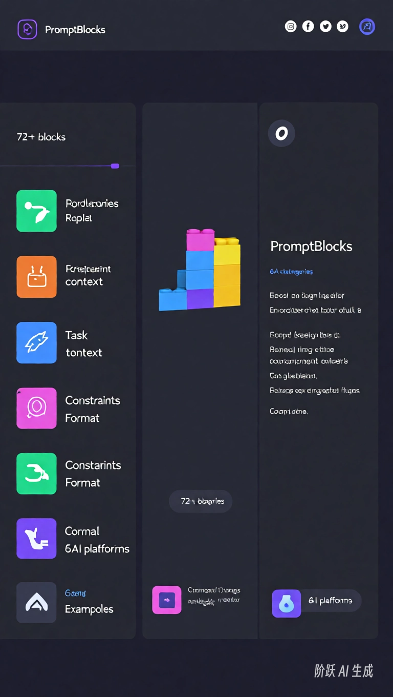
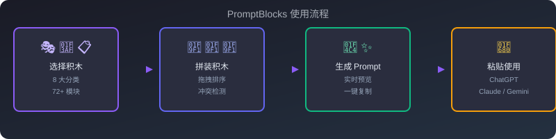

# PromptBlocks 🧱

> 像搭积木一样拼 Prompt | 开源免费的 AI 提示词拼装工具

[](https://opensource.org/licenses/MIT)
[](https://wyjing333-dev.github.io/promptblocks/)
[](https://wyjing333-dev.github.io/promptblocks/)
[](https://wyjing333-dev.github.io/promptblocks/)
[](https://github.com/wyjing333-dev/promptblocks/tree/master/mcp-server)

## 👀 这是什么？

PromptBlocks 是一个**零门槛**的 Prompt 拼装工具。

不需要理解 Prompt Engineering，不需要背诵框架——像搭乐高一样，选几块积木拼在一起，就能生成专业级 Prompt。

🎯 **免登录、免安装、免费用**，打开网页直接用。

## 📸 Demo





## ✨ 核心功能

- **72+ 积木模块**：8 大分类（角色/任务/上下文/约束/格式/示例/行业/决策），覆盖主流使用场景
- **10+ 行业积木**：律师、医生、CPA、电商、HR、SEO、心理咨询师、金融分析师等专业方向
- **⚡ 快捷模式**：不想拼积木？直接打字，AI 实时评分并推荐积木
- **🧩 积木推荐器**：描述你的任务，自动推荐最合适的积木组合
- **🔍 Prompt 评分器**：5 维度评估你的 Prompt 质量，低分维度标红 + 一键修复
- **📊 效果案例库**：10 个预设模板的"普通写法 vs 积木拼装"对比案例
- **⚠️ 冲突检测**：积木之间有矛盾？自动提醒，避免冗余
- **🔗 分享链接**：拼好的积木组合可生成 URL 分享给他人
- **🌐 中英双语**：一键切换中英文界面，72 个积木全部双语
- **🔌 MCP Server**：在 Claude Desktop / Cursor / VS Code 中直接调用积木库
- **📖 交互式教程**：5 步上手，首次访问自动弹出
- **一键复制**：拼好直接复制到 ChatGPT / Claude / 阶跃星辰 / Gemini 等平台
- **纯前端**：无后端依赖，部署即用

## 🚀 快速开始

**在线体验**：访问 [wyjing333-dev.github.io/promptblocks](https://wyjing333-dev.github.io/promptblocks/)

**本地运行**：
```bash
git clone https://github.com/wyjing333-dev/promptblocks.git
cd promptblocks
# 双击 index.html 即可在浏览器中使用
```

**分享积木组合**：直接用 URL 分享，例如：
```
https://wyjing333-dev.github.io/promptblocks/?blocks=role-marketer,task-write-copy,fmt-list
```

## 📊 积木分类

| 分类 | 图标 | 作用 | 积木数 |
|------|------|------|--------|
| 角色 | 🎭 | 设定 AI 身份、专业领域 | 13 |
| 任务 | 🎯 | 明确要完成的具体动作 | 15 |
| 上下文 | 📋 | 提供背景信息、受众和目的 | 8 |
| 约束 | ⚙️ | 长度/风格/禁止项等限制 | 7 |
| 格式 | 📐 | 输出结构和形式要求 | 7 |
| 示例 | 💡 | Few-shot 学习样例 | 4 |
| 行业 | 🏢 | 专业领域的定制积木 | 11 |
| 决策 | ⚡ | Agent 决策路由与判断 | 7 |

## 🧩 使用方式

1. 从左侧积木库点击积木，添加到拼装区
2. 调整积木顺序，冲突检测自动运行
3. 右侧实时预览完整 Prompt
4. 点击「复制 Prompt」直接粘贴到你的 AI 平台
5. 点「🔗 分享」生成链接，分享你的积木组合

> 💡 不想拼？切到「⚡ 快捷」模式直接打字，或用「🧩 推荐器」描述任务自动推荐积木。

## 🔌 MCP Server

在 Claude Desktop / Cursor / VS Code 等 MCP 客户端中直接调用 PromptBlocks 积木库：

```json
{
  "mcpServers": {
    "promptblocks": {
      "command": "node",
      "args": ["/path/to/promptblocks/mcp-server/server.mjs"]
    }
  }
}
```

提供 7 个工具：`list_categories`、`list_blocks`、`search_blocks`、`get_block`、`assemble_prompt`、`list_presets`、`load_preset`。详见 [MCP Server 文档](mcp-server/README.md)。

## 🔧 技术栈

- HTML5 + CSS3 + Vanilla JavaScript
- 无框架依赖，无构建步骤
- GitHub Pages 静态部署
- MCP: @modelcontextprotocol/sdk + zod

## 🤝 贡献

欢迎提交新积木！访问 [提交积木入口](https://github.com/wyjing333-dev/promptblocks/issues/new?labels=submit-block&template=submit-block.md&title=提交新积木) 直接提交。

## ⭐ Star History

如果觉得好用，给个 Star ⭐ 支持一下吧！

## License

MIT
